# GCP Crash Course for AWS Professionals

## An Example-First, Actionable Guide to Google Cloud Platform

## Table of Contents

1. [Course Overview](#course-overview)
2. [Module 1: GCP Fundamentals & AWS Translation](#module-1-gcp-fundamentals--aws-translation)
3. [Module 2: Identity & Access Management](#module-2-identity--access-management)
4. [Module 3: Compute Services Deep Dive](#module-3-compute-services-deep-dive)
5. [Module 4: Storage & Databases](#module-4-storage--databases)
6. [Module 5: Networking](#module-5-networking)
7. [Module 6: Container Services](#module-6-container-services)
8. [Module 7: Serverless & Functions](#module-7-serverless--functions)
9. [Module 8: Data & Analytics](#module-8-data--analytics)
10. [Module 9: DevOps & CI/CD](#module-9-devops--cicd)
11. [Module 10: Monitoring & Observability](#module-10-monitoring--observability)
12. [Module 11: Cost Management](#module-11-cost-management)
13. [Module 12: Real-World Project](#module-12-real-world-project)

---

## Course Overview

### Target Audience
- AWS professionals with 2+ years experience
- Cloud architects and engineers
- DevOps professionals migrating to GCP

### Learning Approach
- **Example-First**: Every concept starts with a practical example
- **AWS Translation**: Direct comparisons and migration strategies
- **Hands-On Labs**: Build real infrastructure as you learn
- **Mermaid Diagrams**: Visual representation of complex architectures

### Prerequisites
- AWS experience (EC2, S3, VPC, IAM)
- Basic CLI/terminal skills
- Understanding of cloud computing concepts

---

## Module 1: GCP Fundamentals & AWS Translation

### 1.1 GCP Project Structure vs AWS Account Model

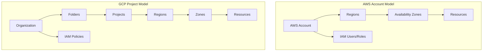

#### Example 1: Setting Up Your First GCP Project
**AWS Equivalent**: Creating a new AWS account or setting up a new environment

```bash
# Install gcloud CLI (equivalent to AWS CLI)
curl https://sdk.cloud.google.com | bash
exec -l $SHELL

# Initialize and authenticate
gcloud init

# Create a new project
gcloud projects create my-first-gcp-project --name="My First GCP Project"

# Set the project as default
gcloud config set project my-first-gcp-project

# Enable necessary APIs (equivalent to AWS service activation)
gcloud services enable compute.googleapis.com
gcloud services enable storage.googleapis.com
gcloud services enable container.googleapis.com
```

### 1.2 Service Mapping: AWS to GCP

| AWS Service | GCP Equivalent | Key Differences |
|-------------|----------------|-----------------|
| EC2 | Compute Engine | Machine types vs instance types |
| S3 | Cloud Storage | Buckets are global, not regional |
| RDS | Cloud SQL | Managed differently, pricing model |
| Lambda | Cloud Functions | Different triggers and limits |
| EKS | GKE | More integrated, autopilot mode |
| Route 53 | Cloud DNS | Different zone management |
| CloudFormation | Deployment Manager/Terraform | Less mature native option |

#### Example 2: CLI Command Translation
```bash
# AWS: List EC2 instances
aws ec2 describe-instances

# GCP: List Compute Engine instances
gcloud compute instances list

# AWS: Create S3 bucket
aws s3 mb s3://my-bucket

# GCP: Create Cloud Storage bucket
gsutil mb gs://my-bucket

# AWS: Deploy CloudFormation stack
aws cloudformation create-stack --stack-name my-stack --template-body file://template.yaml

# GCP: Deploy Deployment Manager template
gcloud deployment-manager deployments create my-deployment --config config.yaml
```

---

## Module 2: Identity & Access Management

### 2.1 IAM Architecture Comparison

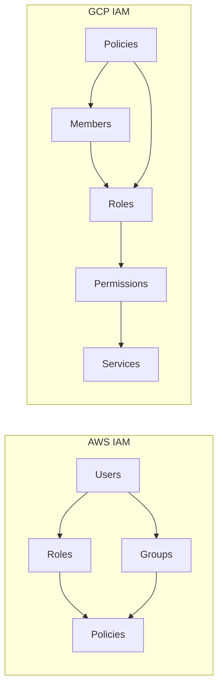

#### Example 3: Creating Service Accounts (AWS IAM Roles equivalent)
```bash
# Create a service account for your application
gcloud iam service-accounts create my-app-sa \
    --display-name="My Application Service Account" \
    --description="Service account for my application"

# Grant specific roles (equivalent to attaching policies in AWS)
gcloud projects add-iam-policy-binding my-first-gcp-project \
    --member="serviceAccount:my-app-sa@my-first-gcp-project.iam.gserviceaccount.com" \
    --role="roles/storage.objectViewer"

# Generate and download key (equivalent to AWS access keys)
gcloud iam service-accounts keys create ~/key.json \
    --iam-account=my-app-sa@my-first-gcp-project.iam.gserviceaccount.com
```

#### Example 4: Custom Role Creation
```bash
# Create a custom role definition file
cat > custom-role.yaml << EOF
title: "Custom Storage Role"
description: "Custom role for storage operations"
stage: "GA"
includedPermissions:
- storage.objects.get
- storage.objects.list
- storage.buckets.get
EOF

# Create the custom role
gcloud iam roles create customStorageRole \
    --project=my-first-gcp-project \
    --file=custom-role.yaml
```

### 2.2 Resource Hierarchy and Inheritance

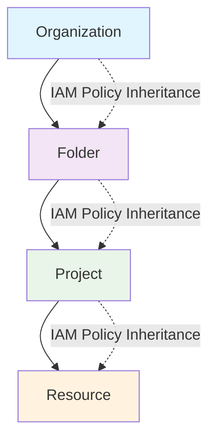

---

## Module 3: Compute Services Deep Dive

### 3.1 Compute Engine vs EC2

#### Example 5: Creating VM Instances with Best Practices
```bash
# Create a VM with startup script (equivalent to EC2 user data)
gcloud compute instances create web-server-1 \
    --zone=us-central1-a \
    --machine-type=e2-medium \
    --network-tier=PREMIUM \
    --maintenance-policy=MIGRATE \
    --image=ubuntu-2004-focal-v20240110 \
    --image-project=ubuntu-os-cloud \
    --boot-disk-size=20GB \
    --boot-disk-type=pd-standard \
    --tags=http-server,https-server \
    --metadata-from-file startup-script=startup.sh

# Create firewall rules (equivalent to security groups)
gcloud compute firewall-rules create allow-http \
    --allow tcp:80 \
    --source-ranges 0.0.0.0/0 \
    --target-tags http-server
```

#### Example 6: Instance Templates and Managed Instance Groups
```bash
# Create instance template (equivalent to launch template)
gcloud compute instance-templates create web-server-template \
    --machine-type=e2-medium \
    --network-interface=network-tier=PREMIUM,subnet=default \
    --image=ubuntu-2004-focal-v20240110 \
    --image-project=ubuntu-os-cloud \
    --boot-disk-size=20GB \
    --metadata-from-file startup-script=startup.sh \
    --tags=http-server

# Create managed instance group (equivalent to auto scaling group)
gcloud compute instance-groups managed create web-server-group \
    --base-instance-name=web-server \
    --size=3 \
    --template=web-server-template \
    --zone=us-central1-a

# Set up autoscaling
gcloud compute instance-groups managed set-autoscaling web-server-group \
    --zone=us-central1-a \
    --max-num-replicas=10 \
    --min-num-replicas=2 \
    --target-cpu-utilization=0.6
```

### 3.2 Load Balancing Architecture

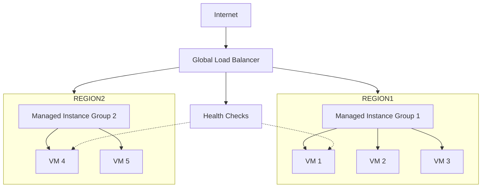

#### Example 7: Setting Up Global Load Balancer
```bash
# Create health check
gcloud compute health-checks create http basic-check \
    --port 80 \
    --request-path=/health

# Create backend service
gcloud compute backend-services create web-backend-service \
    --protocol=HTTP \
    --port-name=http \
    --health-checks=basic-check \
    --global

# Add instance group to backend service
gcloud compute backend-services add-backend web-backend-service \
    --instance-group=web-server-group \
    --instance-group-zone=us-central1-a \
    --global

# Create URL map
gcloud compute url-maps create web-map \
    --default-service web-backend-service

# Create HTTP(S) proxy
gcloud compute target-http-proxies create http-lb-proxy \
    --url-map web-map

# Create global forwarding rule
gcloud compute forwarding-rules create http-content-rule \
    --global \
    --target-http-proxy=http-lb-proxy \
    --ports=80
```

---

## Module 4: Storage & Databases

### 4.1 Cloud Storage vs S3

#### Example 8: Advanced Cloud Storage Operations
```bash
# Create bucket with specific storage class and location
gsutil mb -c STANDARD -l US-CENTRAL1 gs://my-company-data-lake

# Set lifecycle policy (equivalent to S3 lifecycle rules)
cat > lifecycle.json << EOF
{
  "lifecycle": {
    "rule": [
      {
        "action": {"type": "SetStorageClass", "storageClass": "NEARLINE"},
        "condition": {"age": 30}
      },
      {
        "action": {"type": "SetStorageClass", "storageClass": "COLDLINE"},
        "condition": {"age": 90}
      },
      {
        "action": {"type": "Delete"},
        "condition": {"age": 365}
      }
    ]
  }
}
EOF

gsutil lifecycle set lifecycle.json gs://my-company-data-lake

# Enable versioning
gsutil versioning set on gs://my-company-data-lake

# Sync directories (equivalent to aws s3 sync)
gsutil -m rsync -r -d ./local-folder gs://my-company-data-lake/data/
```

### 4.2 Database Services Comparison

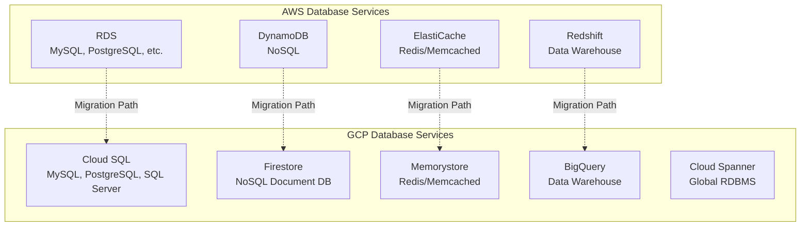

#### Example 9: Setting Up Cloud SQL with High Availability
```bash
# Create Cloud SQL instance with HA
gcloud sql instances create my-postgres-instance \
    --database-version=POSTGRES_13 \
    --tier=db-f1-micro \
    --region=us-central1 \
    --availability-type=REGIONAL \
    --storage-size=20GB \
    --storage-type=SSD \
    --backup-start-time=03:00 \
    --enable-bin-log

# Create database
gcloud sql databases create my-app-db --instance=my-postgres-instance

# Create user
gcloud sql users create app-user \
    --instance=my-postgres-instance \
    --password=secure-password-123

# Connect to instance
gcloud sql connect my-postgres-instance --user=app-user --database=my-app-db
```

#### Example 10: Firestore Setup and Basic Operations
```bash
# Enable Firestore API
gcloud services enable firestore.googleapis.com

# Create Firestore database
gcloud firestore databases create --region=us-central1

# Sample Python code for Firestore operations
cat > firestore_example.py << EOF
from google.cloud import firestore

# Initialize Firestore client
db = firestore.Client()

# Add document
doc_ref = db.collection('users').document('user1')
doc_ref.set({
    'name': 'John Doe',
    'email': 'john@example.com',
    'created_at': firestore.SERVER_TIMESTAMP
})

# Query documents
users_ref = db.collection('users')
docs = users_ref.stream()

for doc in docs:
    print(f'{doc.id} => {doc.to_dict()}')
EOF
```

---

## Module 5: Networking

### 5.1 VPC Architecture Comparison

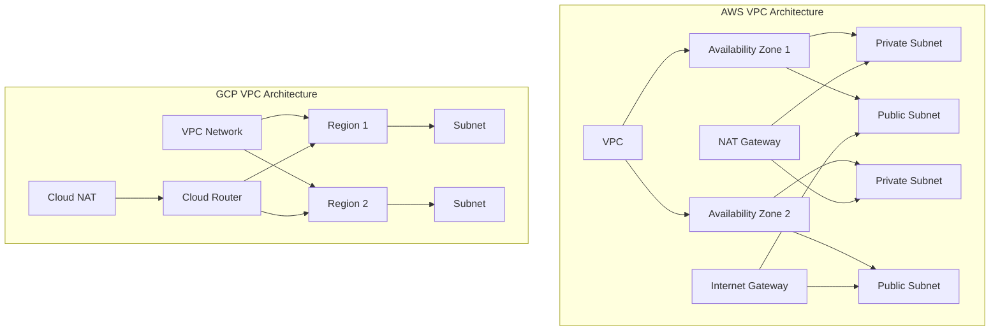

#### Example 11: Creating Custom VPC Network
```bash
# Create custom VPC network
gcloud compute networks create my-custom-vpc \
    --subnet-mode=custom \
    --bgp-routing-mode=global

# Create subnets in different regions
gcloud compute networks subnets create my-subnet-us \
    --network=my-custom-vpc \
    --range=10.1.0.0/16 \
    --region=us-central1 \
    --enable-private-ip-google-access

gcloud compute networks subnets create my-subnet-eu \
    --network=my-custom-vpc \
    --range=10.2.0.0/16 \
    --region=europe-west1 \
    --enable-private-ip-google-access

# Create firewall rules
gcloud compute firewall-rules create allow-internal \
    --network=my-custom-vpc \
    --allow=tcp,udp,icmp \
    --source-ranges=10.1.0.0/16,10.2.0.0/16

gcloud compute firewall-rules create allow-ssh \
    --network=my-custom-vpc \
    --allow=tcp:22 \
    --source-ranges=0.0.0.0/0 \
    --target-tags=ssh-server
```

#### Example 12: Setting Up Cloud NAT and Cloud Router
```bash
# Create Cloud Router
gcloud compute routers create my-router \
    --network=my-custom-vpc \
    --region=us-central1

# Create Cloud NAT
gcloud compute routers nats create my-nat-gateway \
    --router=my-router \
    --region=us-central1 \
    --nat-all-subnet-ip-ranges \
    --auto-allocate-nat-external-ips
```

### 5.2 Hybrid Connectivity Options

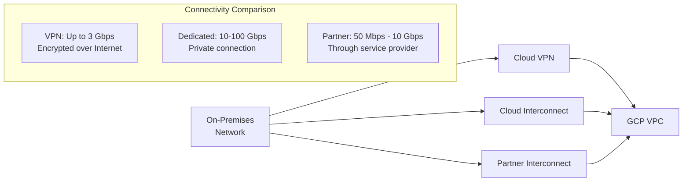

---

## Module 6: Container Services

### 6.1 GKE vs EKS Architecture

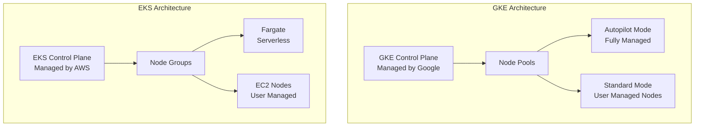

#### Example 13: Creating GKE Cluster with Autopilot
```bash
# Create GKE Autopilot cluster (equivalent to EKS Fargate)
gcloud container clusters create-auto my-autopilot-cluster \
    --region=us-central1 \
    --release-channel=regular

# Get credentials for kubectl
gcloud container clusters get-credentials my-autopilot-cluster \
    --region=us-central1

# Deploy sample application
kubectl create deployment nginx --image=nginx:latest
kubectl expose deployment nginx --type=LoadBalancer --port=80
kubectl get services
```

#### Example 14: Standard GKE Cluster with Node Pools
```bash
# Create standard GKE cluster
gcloud container clusters create my-standard-cluster \
    --zone=us-central1-a \
    --num-nodes=3 \
    --enable-autoscaling \
    --min-nodes=1 \
    --max-nodes=10 \
    --machine-type=e2-medium \
    --enable-autorepair \
    --enable-autoupgrade

# Add additional node pool for specific workloads
gcloud container node-pools create high-memory-pool \
    --cluster=my-standard-cluster \
    --zone=us-central1-a \
    --machine-type=n1-highmem-2 \
    --num-nodes=2 \
    --enable-autoscaling \
    --min-nodes=0 \
    --max-nodes=5
```

### 6.2 Cloud Run vs AWS Fargate

#### Example 15: Deploying to Cloud Run
```bash
# Deploy container to Cloud Run
gcloud run deploy my-api \
    --image=gcr.io/my-project/my-api:latest \
    --platform=managed \
    --region=us-central1 \
    --allow-unauthenticated \
    --memory=512Mi \
    --cpu=1 \
    --min-instances=0 \
    --max-instances=100 \
    --concurrency=80

# Set environment variables
gcloud run services update my-api \
    --region=us-central1 \
    --set-env-vars="DB_HOST=my-db-host,API_KEY=my-secret-key"

# Configure custom domain
gcloud run domain-mappings create \
    --service=my-api \
    --domain=api.mydomain.com \
    --region=us-central1
```

---

## Module 7: Serverless & Functions

### 7.1 Cloud Functions vs Lambda

#### Example 16: HTTP Cloud Function
```bash
# Create a simple HTTP function
mkdir my-function && cd my-function

# Create main.py
cat > main.py << EOF
import functions_framework
import json

@functions_framework.http
def hello_world(request):
    """HTTP Cloud Function.
    Args:
        request (flask.Request): The request object.
    Returns:
        The response text, or any set of values that can be turned into a
        Response object using `make_response`.
    """
    request_json = request.get_json(silent=True)
    
    if request_json and 'name' in request_json:
        name = request_json['name']
    else:
        name = 'World'
    
    return json.dumps({'message': f'Hello {name}!'})
EOF

# Create requirements.txt
cat > requirements.txt << EOF
functions-framework==3.*
EOF

# Deploy function
gcloud functions deploy hello-http \
    --runtime=python39 \
    --trigger=http \
    --entry-point=hello_world \
    --allow-unauthenticated \
    --region=us-central1
```

#### Example 17: Event-Driven Function (Pub/Sub)
```bash
# Create Pub/Sub topic
gcloud pubsub topics create my-topic

# Create function triggered by Pub/Sub
cat > main.py << EOF
import base64
import json
import functions_framework

@functions_framework.cloud_event
def process_message(cloud_event):
    """Process Pub/Sub message."""
    # Decode the Pub/Sub message
    message_data = base64.b64decode(cloud_event.data['message']['data']).decode('utf-8')
    message_json = json.loads(message_data)
    
    print(f"Processing message: {message_json}")
    
    # Your processing logic here
    return "Message processed successfully"
EOF

# Deploy Pub/Sub triggered function
gcloud functions deploy process-pubsub \
    --runtime=python39 \
    --trigger-topic=my-topic \
    --entry-point=process_message \
    --region=us-central1
```

### 7.2 Event-Driven Architecture

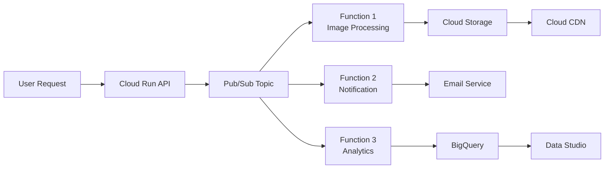

---

## Module 8: Data & Analytics

### 8.1 BigQuery vs Redshift

#### Example 18: BigQuery Data Pipeline
```bash
# Create BigQuery dataset
bq mk --dataset --location=US my_project:analytics

# Create table with schema
bq mk --table \
    my_project:analytics.user_events \
    user_id:STRING,event_type:STRING,timestamp:TIMESTAMP,properties:JSON

# Load data from Cloud Storage
bq load \
    --source_format=CSV \
    --skip_leading_rows=1 \
    my_project:analytics.user_events \
    gs://my-bucket/user_events.csv \
    user_id:STRING,event_type:STRING,timestamp:TIMESTAMP,properties:JSON

# Sample analytics query
bq query --use_legacy_sql=false \
'SELECT 
    event_type,
    COUNT(*) as event_count,
    COUNT(DISTINCT user_id) as unique_users
FROM `my_project.analytics.user_events`
WHERE DATE(timestamp) = CURRENT_DATE()
GROUP BY event_type
ORDER BY event_count DESC'
```

### 8.2 Data Pipeline Architecture

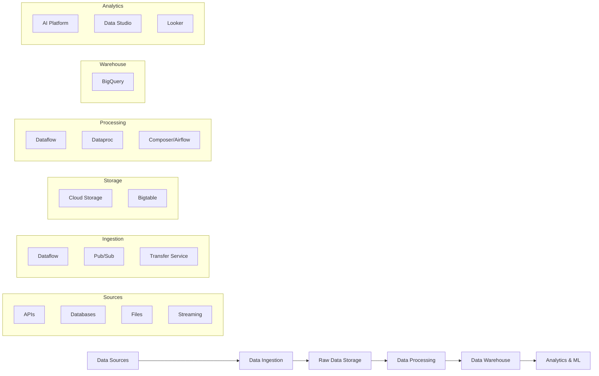

#### Example 19: Dataflow Pipeline
```python
# Apache Beam pipeline for batch processing
import apache_beam as beam
from apache_beam.options.pipeline_options import PipelineOptions

def run_pipeline():
    pipeline_options = PipelineOptions([
        '--project=my-project',
        '--region=us-central1',
        '--runner=DataflowRunner',
        '--temp_location=gs://my-bucket/temp',
        '--staging_location=gs://my-bucket/staging'
    ])
    
    with beam.Pipeline(options=pipeline_options) as pipeline:
        (pipeline
         | 'Read from BigQuery' >> beam.io.ReadFromBigQuery(
             query='SELECT * FROM `my_project.analytics.raw_events`',
             use_standard_sql=True)
         | 'Transform Data' >> beam.Map(transform_event)
         | 'Write to BigQuery' >> beam.io.WriteToBigQuery(
             'my_project:analytics.processed_events',
             write_disposition=beam.io.BigQueryDisposition.WRITE_APPEND))

def transform_event(event):
    # Your transformation logic
    return {
        'user_id': event['user_id'],
        'event_type': event['event_type'].upper(),
        'processed_timestamp': datetime.utcnow().isoformat()
    }

if __name__ == '__main__':
    run_pipeline()
```

---

## Module 9: DevOps & CI/CD

### 9.1 Cloud Build vs CodePipeline

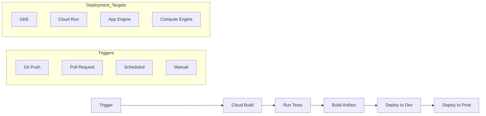

#### Example 20: Cloud Build Pipeline
```yaml
# cloudbuild.yaml
steps:
# Build Docker image
- name: 'gcr.io/cloud-builders/docker'
  args: ['build', '-t', 'gcr.io/$PROJECT_ID/my-app:$BUILD_ID', '.']

# Run tests
- name: 'gcr.io/$PROJECT_ID/my-app:$BUILD_ID'
  entrypoint: 'npm'
  args: ['test']

# Push to Container Registry
- name: 'gcr.io/cloud-builders/docker'
  args: ['push', 'gcr.io/$PROJECT_ID/my-app:$BUILD_ID']

# Deploy to Cloud Run (dev)
- name: 'gcr.io/cloud-builders/gcloud'
  args:
  - 'run'
  - 'deploy'
  - 'my-app-dev'
  - '--image'
  - 'gcr.io/$PROJECT_ID/my-app:$BUILD_ID'
  - '--region'
  - 'us-central1'
  - '--platform'
  - 'managed'
  - '--allow-unauthenticated'

# Deploy to GKE (prod) - conditional on branch
- name: 'gcr.io/cloud-builders/kubectl'
  args:
  - 'set'
  - 'image'
  - 'deployment/my-app'
  - 'my-app=gcr.io/$PROJECT_ID/my-app:$BUILD_ID'
  env:
  - 'CLOUDSDK_COMPUTE_ZONE=us-central1-a'
  - 'CLOUDSDK_CONTAINER_CLUSTER=production-cluster'
  condition: ['$BRANCH_NAME', '==', 'main']

# Notifications
- name: 'gcr.io/cloud-builders/gcloud'
  args: ['functions', 'call', 'notify-deployment', '--data', '{"status":"success","build_id":"$BUILD_ID"}']

options:
  logging: CLOUD_LOGGING_ONLY

# Trigger configuration
trigger:
  branch:
    name: '^(main|develop)$'
  includedFiles:
  - 'src/**'
  - 'Dockerfile'
  - 'package.json'
```

#### Example 21: Infrastructure as Code with Terraform
```bash
# Create Terraform configuration for GCP
mkdir terraform-gcp && cd terraform-gcp

# main.tf
cat > main.tf << EOF
terraform {
  required_providers {
    google = {
      source  = "hashicorp/google"
      version = "~> 4.0"
    }
  }
  backend "gcs" {
    bucket = "my-terraform-state-bucket"
    prefix = "terraform/state"
  }
}

provider "google" {
  project = var.project_id
  region  = var.region
}

# Variables
variable "project_id" {
  description = "GCP Project ID"
  type        = string
}

variable "region" {
  description = "GCP Region"
  type        = string
  default     = "us-central1"
}

# VPC Network
resource "google_compute_network" "vpc_network" {
  name                    = "my-vpc-network"
  auto_create_subnetworks = false
}

# Subnet
resource "google_compute_subnetwork" "subnet" {
  name          = "my-subnet"
  ip_cidr_range = "10.0.0.0/16"
  region        = var.region
  network       = google_compute_network.vpc_network.id
}

# GKE Cluster
resource "google_container_cluster" "primary" {
  name     = "my-gke-cluster"
  location = var.region

  remove_default_node_pool = true
  initial_node_count       = 1

  network    = google_compute_network.vpc_network.name
  subnetwork = google_compute_subnetwork.subnet.name
}

# Node Pool
resource "google_container_node_pool" "primary_nodes" {
  name       = "my-node-pool"
  location   = var.region
  cluster    = google_container_cluster.primary.name
  node_count = 1

  node_config {
    machine_type = "e2-medium"
    disk_size_gb = 20
    disk_type    = "pd-ssd"

    oauth_scopes = [
      "https://www.googleapis.com/auth/cloud-platform"
    ]
  }

  autoscaling {
    min_node_count = 1
    max_node_count = 3
  }
}

# Cloud SQL Instance
resource "google_sql_database_instance" "main" {
  name             = "my-postgres-instance"
  database_version = "POSTGRES_13"
  region           = var.region

  settings {
    tier = "db-f1-micro"

    backup_configuration {
      enabled = true
    }
  }
}

# Outputs
output "kubernetes_cluster_name" {
  value = google_container_cluster.primary.name
}

output "sql_instance_connection_name" {
  value = google_sql_database_instance.main.connection_name
}
EOF

# Deploy infrastructure
terraform init
terraform plan -var="project_id=my-project-id"
terraform apply -var="project_id=my-project-id"
```

---

## Module 10: Monitoring & Observability

### 10.1 Cloud Monitoring vs CloudWatch

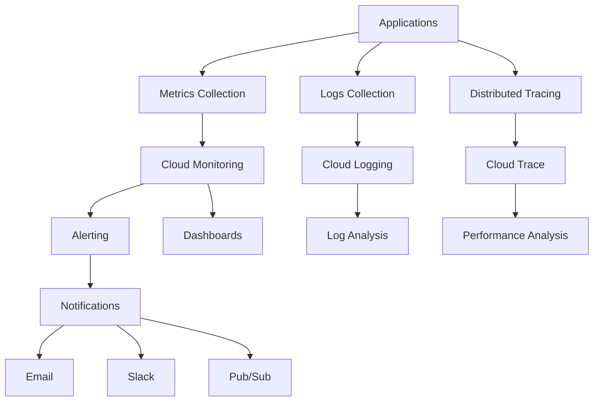

#### Example 22: Setting Up Monitoring and Alerting
```bash
# Create notification channel
gcloud alpha monitoring channels create \
    --display-name="Email Notifications" \
    --type=email \
    --channel-labels=email_address=admin@mycompany.com

# Create alerting policy
cat > alert-policy.yaml << EOF
displayName: "High CPU Usage Alert"
conditions:
  - displayName: "CPU usage above 80%"
    conditionThreshold:
      filter: 'resource.type="gce_instance"'
      comparison: COMPARISON_GREATER_THAN
      thresholdValue: 0.8
      duration: 300s
      aggregations:
        - alignmentPeriod: 60s
          perSeriesAligner: ALIGN_MEAN
          crossSeriesReducer: REDUCE_MEAN
          groupByFields:
            - resource.instance_id
combiner: OR
enabled: true
notificationChannels:
  - projects/my-project/notificationChannels/CHANNEL_ID
EOF

gcloud alpha monitoring policies create --policy-from-file=alert-policy.yaml
```

#### Example 23: Custom Metrics and Dashboards
```python
# Python code to send custom metrics
from google.cloud import monitoring_v3
import time

def send_custom_metric():
    client = monitoring_v3.MetricServiceClient()
    project_name = f"projects/{PROJECT_ID}"
    
    # Create metric descriptor
    descriptor = monitoring_v3.MetricDescriptor()
    descriptor.type = "custom.googleapis.com/my_app/user_signups"
    descriptor.metric_kind = monitoring_v3.MetricDescriptor.MetricKind.GAUGE
    descriptor.value_type = monitoring_v3.MetricDescriptor.ValueType.INT64
    descriptor.description = "Number of user signups"
    
    # Create time series
    series = monitoring_v3.TimeSeries()
    series.metric.type = descriptor.type
    series.resource.type = "gce_instance"
    series.resource.labels["instance_id"] = "my-instance-id"
    series.resource.labels["zone"] = "us-central1-a"
    
    # Add data point
    point = series.points.add()
    point.value.int64_value = 42
    point.interval.end_time.seconds = int(time.time())
    
    # Write time series
    client.create_time_series(name=project_name, time_series=[series])
```

---

## Module 11: Cost Management

### 11.1 Cost Optimization Strategies

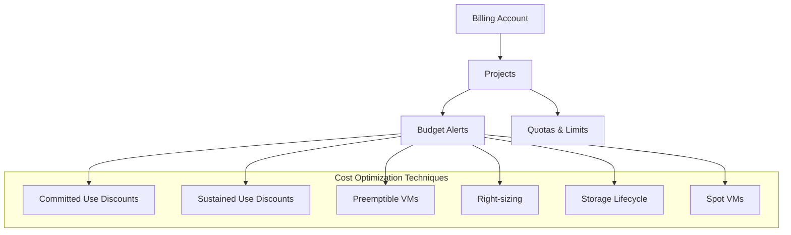

#### Example 24: Cost Management Setup
```bash
# Create budget with alerts
cat > budget.yaml << EOF
displayName: "Monthly Budget Alert"
budgetFilter:
  projects:
    - "projects/my-project-id"
amount:
  specifiedAmount:
    currencyCode: "USD"
    units: "1000"
thresholdRules:
  - thresholdPercent: 0.5
    spendBasis: CURRENT_SPEND
  - thresholdPercent: 0.8
    spendBasis: CURRENT_SPEND
  - thresholdPercent: 1.0
    spendBasis: CURRENT_SPEND
allUpdatesRule:
  monitoringNotificationChannels:
    - "projects/my-project/notificationChannels/CHANNEL_ID"
  disableDefaultIamRecipients: false
EOF

# Set up preemptible instances for cost savings
gcloud compute instances create cost-effective-vm \
    --zone=us-central1-a \
    --machine-type=e2-medium \
    --preemptible \
    --image-family=ubuntu-2004-lts \
    --image-project=ubuntu-os-cloud
```

#### Example 25: Resource Cleanup Automation
```bash
# Script to identify and clean up unused resources
cat > cleanup.sh << EOF
#!/bin/bash

# Find unattached disks
echo "Unattached disks:"
gcloud compute disks list --filter="NOT users:*" --format="table(name,zone,sizeGb,status)"

# Find unused static IPs
echo "Unused static IP addresses:"
gcloud compute addresses list --filter="status:RESERVED" --format="table(name,region,status)"

# Find old snapshots (older than 30 days)
echo "Old snapshots:"
gcloud compute snapshots list \
    --filter="creationTimestamp<$(date -d '30 days ago' '+%Y-%m-%d')" \
    --format="table(name,sourceDisk,creationTimestamp)"

# Find stopped instances running for more than 7 days
echo "Long-stopped instances:"
gcloud compute instances list \
    --filter="status:TERMINATED" \
    --format="table(name,zone,status,lastStartTimestamp)"
EOF

chmod +x cleanup.sh
./cleanup.sh
```

---

## Module 12: Real-World Project

### 12.1 Project Architecture: E-commerce Platform Migration

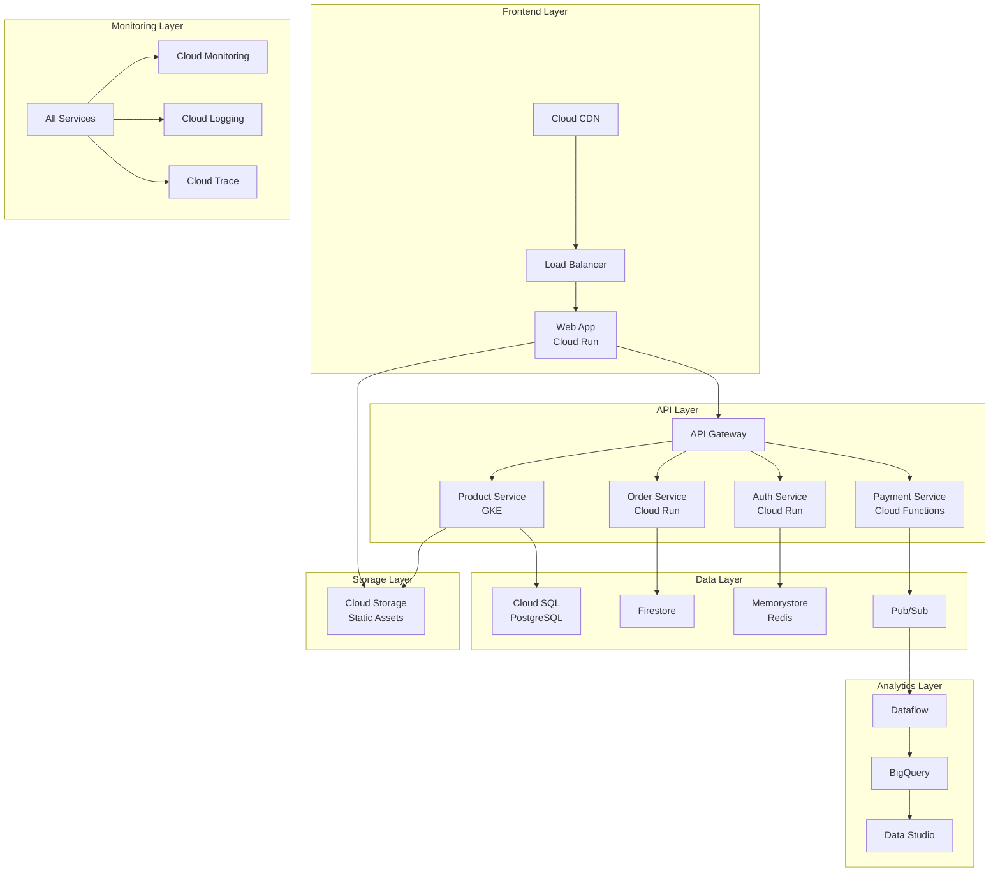

### 12.2 Implementation Steps

#### Step 1: Infrastructure Setup
```bash
# Set up the project and enable APIs
gcloud projects create ecommerce-gcp-migration
gcloud config set project ecommerce-gcp-migration

# Enable all required APIs
gcloud services enable \
    compute.googleapis.com \
    container.googleapis.com \
    run.googleapis.com \
    sql.googleapis.com \
    firestore.googleapis.com \
    storage.googleapis.com \
    cloudbuild.googleapis.com \
    monitoring.googleapis.com \
    logging.googleapis.com \
    cloudtrace.googleapis.com
```

#### Step 2: Database Migration
```bash
# Create Cloud SQL instance for product catalog
gcloud sql instances create ecommerce-db \
    --database-version=POSTGRES_13 \
    --tier=db-n1-standard-2 \
    --region=us-central1 \
    --availability-type=REGIONAL \
    --storage-size=100GB \
    --backup-start-time=03:00

# Import existing data
gcloud sql import sql ecommerce-db gs://migration-bucket/database-dump.sql
```

#### Step 3: Container Services Deployment
```bash
# Create GKE cluster for product service
gcloud container clusters create ecommerce-cluster \
    --zone=us-central1-a \
    --num-nodes=3 \
    --enable-autoscaling \
    --min-nodes=2 \
    --max-nodes=10 \
    --machine-type=n1-standard-2

# Deploy microservices
kubectl apply -f k8s-manifests/
```

#### Step 4: Serverless Services
```bash
# Deploy Cloud Run services
gcloud run deploy auth-service \
    --image=gcr.io/ecommerce-gcp-migration/auth:latest \
    --region=us-central1 \
    --allow-unauthenticated

gcloud run deploy order-service \
    --image=gcr.io/ecommerce-gcp-migration/orders:latest \
    --region=us-central1 \
    --allow-unauthenticated
```

### 12.3 Migration Strategy

#### Example 26: Blue-Green Deployment Script
```bash
#!/bin/bash

# Blue-Green deployment for zero-downtime migration
CURRENT_SERVICE=$(gcloud run services describe production-api --region=us-central1 --format="value(spec.traffic[0].revisionName)")
NEW_REVISION="production-api-$(date +%Y%m%d-%H%M%S)"

# Deploy new revision with 0% traffic
gcloud run deploy production-api \
    --image=gcr.io/ecommerce-gcp-migration/api:latest \
    --region=us-central1 \
    --no-traffic \
    --tag=blue

# Gradually shift traffic
gcloud run services update-traffic production-api \
    --region=us-central1 \
    --to-revisions=blue=10

# Monitor metrics and health checks
sleep 300

# If healthy, continue migration
gcloud run services update-traffic production-api \
    --region=us-central1 \
    --to-revisions=blue=50

sleep 300

# Complete migration
gcloud run services update-traffic production-api \
    --region=us-central1 \
    --to-revisions=blue=100
```

### 12.4 Performance Testing and Optimization

#### Example 27: Load Testing with Apache Beam
```python
# Dataflow pipeline for generating load test data
import apache_beam as beam
from apache_beam.options.pipeline_options import PipelineOptions
import requests
import random

class GenerateLoadTest(beam.DoFn):
    def process(self, element):
        # Generate realistic e-commerce API calls
        endpoints = [
            '/api/products',
            '/api/orders',
            '/api/users/profile',
            '/api/cart'
        ]
        
        for _ in range(element):
            endpoint = random.choice(endpoints)
            response = requests.get(f"https://my-api.a.run.app{endpoint}")
            yield {
                'endpoint': endpoint,
                'status_code': response.status_code,
                'response_time': response.elapsed.total_seconds(),
                'timestamp': beam.window.TimestampedValue.now()
            }

def run_load_test():
    pipeline_options = PipelineOptions([
        '--project=ecommerce-gcp-migration',
        '--region=us-central1',
        '--runner=DataflowRunner'
    ])
    
    with beam.Pipeline(options=pipeline_options) as pipeline:
        (pipeline
         | 'Create Load' >> beam.Create([100] * 10)  # 10 workers, 100 requests each
         | 'Generate Requests' >> beam.ParDo(GenerateLoadTest())
         | 'Write Results' >> beam.io.WriteToBigQuery(
             'ecommerce-gcp-migration:analytics.load_test_results'))
```

---

## Course Completion Checklist

### ✅ Skills Acquired
- [ ] GCP project setup and organization
- [ ] IAM and security best practices
- [ ] Compute services migration strategies
- [ ] Storage and database optimization
- [ ] Network architecture design
- [ ] Container orchestration with GKE
- [ ] Serverless architecture implementation
- [ ] Data pipeline construction
- [ ] CI/CD pipeline setup
- [ ] Monitoring and observability
- [ ] Cost optimization techniques
- [ ] Real-world migration execution

### 🛠️ Hands-On Labs Completed
- [ ] Multi-region VPC setup
- [ ] GKE cluster deployment
- [ ] Cloud Run microservices
- [ ] BigQuery data warehouse
- [ ] Cloud Build CI/CD pipeline
- [ ] Monitoring dashboard creation
- [ ] Cost budget configuration
- [ ] Complete e-commerce migration

### 📚 Additional Resources
- [Google Cloud Architecture Center](https://cloud.google.com/architecture)
- [GCP to AWS Service Mapping](https://cloud.google.com/docs/compare/aws)
- [Cloud Migration Guides](https://cloud.google.com/solutions/migration-center)
- [GCP Best Practices](https://cloud.google.com/docs/enterprise/best-practices-for-enterprise-organizations)
- [Terraform GCP Provider](https://registry.terraform.io/providers/hashicorp/google/latest/docs)

### 🎯 Next Steps
1. **Certification Path**: Prepare for Google Cloud Professional Cloud Architect
2. **Advanced Topics**: Explore AI/ML services, Advanced networking, Multi-cloud strategies
3. **Community**: Join GCP communities and contribute to open-source projects
4. **Continuous Learning**: Stay updated with new GCP services and features

---

*This crash course provides a comprehensive foundation for AWS professionals transitioning to Google Cloud Platform. The example-first approach ensures practical knowledge that can be immediately applied in real-world scenarios.*